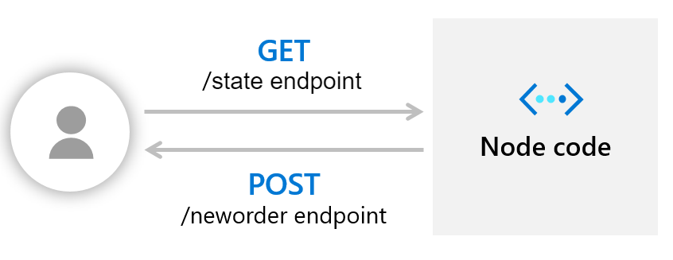
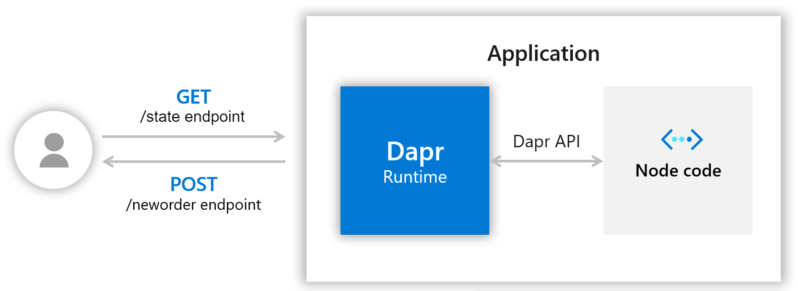

# Hello World

**Objetivos**:
- Aprender a rodar o Dapr localmente;
- Aprender usar a API do Dapr para intermediar a comunicação com microserviçoes;
- Aprender a usar gerenciamento de estados (_state management_) junto com o Dapr;

## 1. Criando um servidor simples com Node.js
De maneira genérica, um servidor _stateful_ recebe uma ordem e é capaz de executar sua tarefa de acordo com a ordem recebida e o seu estado atual.

Vamos, então criar um servidor _stateful_ simples que responde com a soma de todos os valores recebidos até então.

Para criar nosso servidor, vamos usar o `express` para gerenciar os métodos HTTP e `bodyParser` para converter o corpo das requisições para `json`:
~~~js
const express = require('express');
const bodyParser = require('body-parser');

const app = express();
app.use(bodyParser.json());

const port = 3000;

var sum = 0;

app.get('/sum', (req, res) => {
    res.status(200).send("Current sum: " + sum);
});

app.post('/neworder', (req, res) => {
    const data = req.body.data;
    const orderNum = data.orderNum;
    console.log("Got a new order! Order number: " + orderNum);
    
    if (isNaN(orderNum)) {
        res.status(500).send("NaN orderNum");
    } else {
        sum = sum + parseInt(orderNum); 
        res.status(200).send("Sum successfully updated.\nCurrent sum: " + sum);
    }

});

app.listen(port, () => console.log(`Node App listening on port ${port}!`));
~~~

Salve esse código em um arquivo chamado `app.js`.

Para o post, nosso app está configurado para receber um JSON no seguinte formato:
~~~json
{
   "data":{
      "orderNum":"23"
   }
}
~~~

Para simplismente testarmos nosso servidor, podemos executar o comando `node app.js` (lembre de instalar as dependências antes) e, então, enviar as requisições nas rotas criadas.



## 2. Fazendo uso da API do Dapr
Agora que temos [Dapr instalado](../Dapr%20-%20Implementacao.md#Instalações) localmente, podemos utilizá-lo para intermediar a comunicação com nosso servidor.

Para isso, executamos o Dapr ao lado de nossa aplicação com o seguinte comando (lembre que o Docker precisa estar em execução):
~~~sh
dapr run --app-id nodeapp --app-port 3000 --dapr-http-port 3500 node app.js
~~~

Vamos entender o que está acontecendo aqui:
- O `--app-id` define um nome para nossa aplicação. Nesse caso, _nodeapp_;
- O `--app-port` define a porta de comunicação com a aplicação. Como nosso servidor escuta na porta 3000, devemos escolher `--app-port 3000`;
- O `--dapr-http-port` define a porta em que o Dapr escutará. A porta padrão é 3500, mas se não fornecida será escolhida uma porta aleatória;
- E o `node app.js` é o comando para executar nosso servidor.

Podemos, então, interagir com nossa aplicação por meio da API do Dapr.

Para [invocar um método na nossa apliação atravez do Dapr](https://docs.dapr.io/reference/api/service_invocation_api/), usamos:
~~~http
POST/GET/PUT/DELETE http://localhost:<daprPort>/v1.0/invoke/<appId>/method/<method-name>
~~~

No nosso caso, então, temos dois requests possíveis:
~~~http
GET http://localhost:3500/v1.0/invoke/nodeapp/method/sum
~~~
e
~~~http
POST http://localhost:3500/v1.0/invoke/nodeapp/method/order
~~~

O JSON para o post mantém o mesmo formato:
~~~json
{
   "data":{
      "orderNum":"23"
   }
}
~~~



## 3. Salvando estados com a ajuda do Dapr
Até então, nosso servidor funciona bem. Mas caso ocorra alguma falha, e o serviço seja reiniciado, o estado atual será perdido.

Com o Dapr isso pode ser contornado usando seu [componente de gerenciamento de estado](https://github.com/dapr/components-contrib/tree/master/state).

### Configurando o componente de estado
Quando instalado localmente, as configurações dos componentes Dapr se encontram na pasta `$HOME/.dapr/components` para Linux/MacOS e `%USERPROFILE%\.dapr\components` para Windows. Essa pasta contem arquivos de definições yaml para cada componente.

Para o componente de gerenciamento de estado, a instalação normal do Dapr (v1.1 enquanto escrevo isso) já fornece uma configuração padão, utilizando o [Redis](https://redis.io/) como para o armazenamento do estado (_state store_).

Na pasta de componentes, então, já deve ter um arquivo `statestore.yaml` com definições semelhantes a essa:
```yaml
apiVersion: dapr.io/v1alpha1
kind: Component
metadata:
  name: statestore
spec:
  type: state.redis
  metadata:
  - name: redisHost
    value: localhost:6379
  - name: redisPassword
    value: ""
  - name: actorStateStore
    value: "true"
```

Legal! Para o nosso exemplo, então, podemos partir direto para o uso do componente de estado sem nos preocuparmos tanto com sua configuração!

### Usando a API de gerenciamento de estado
Os estados salvos com Dapr seguem o padrão chave/valor. Assim, vários estados podem ser salvos e identificados por sua chave única.

Para [interagir com o serviço de armazenamento de estado por meio da API do Dapr](https://docs.dapr.io/reference/api/state_api/) podemos também utilizar requests HTTP:
- Para salvar um estado: `POST http://localhost:<daprPort>/v1.0/state/<storename>`
- Para obter um estado: `GET http://localhost:<daprPort>/v1.0/state/<storename>/<key>`
- Para deletar um estado: `DELETE http://localhost:<daprPort>/v1.0/state/<storename>/<key>`

O JSON passado no _post_ normalmente terá os campos `key` e `value`:
~~~json
[
    {
    "key": "key1",
    "value": "42"
    },
    {
    "key": "key2",
    "value": {
        "name": "John",
        "age": "23"
        }
    }
]
~~~

Para o nosso caso, `<daprPort>` é 3500. O `<storename>` deve ser o mesmo presente no campo `metadata.name` do arquivo `statestore.yaml`, que no nosso caso é simplesmente `statestore`. `<key>` dependerá do que iremos salvar.

Assim, podemos fazer uso das seguintes URLs:
~~~http
POST http://localhost:3500/v1.0/state/statestore
GET http://localhost:3500/v1.0/state/statestore/<key>
DELETE http://localhost:3500/v1.0/state/statestore/<key>
~~~

### Chamando o componente na aplicação
Agora que sabemos como interagir com o componente de armazenamento de estados, vamos usá-lo para salvar o estado da nossa aplicação.

Comceçaremos adicionando a url que usaremos para nos comunicar com o componente:
~~~js
const daprPort = process.env.DAPR_HTTP_PORT || 3500; // Porta em que o Dapr está escutando
const stateStoreName = `statestore`; // O mesmo presente em metadata.name do arquivo statestore.yaml
const stateUrl = `http://localhost:${daprPort}/v1.0/state/${stateStoreName}`;
~~~

Precisamos, então, entender o que caracteriza o estado de nossa aplicação. Para o nosso simples servidor é fácil: o valor armazenado nas variáveis, ou melhor, na variável `sum`.

Sempre que quisermos salvar um estado podemos, então, criar o seguinte objeto que, seguindo o padrão chave/valor usado no Dapr, armazena o estado atual da nossa aplicação:
~~~js
const state = [{
    key: "variables",
    value: {
        sum: sum
    }
}];
~~~

... E enviarmos ele por meio da API do Dapr:
~~~js
fetch(stateUrl, {
    method: "POST",
    body: JSON.stringify(state),
    headers: {
        "Content-Type": "application/json"
        }
    })
    .then((response) => {
        if (!response.ok) {
            throw "Failed to persist state.";
        }

        console.log("Successfully persisted state.");
        res.status(200).send();
    }).catch((error) => {
        console.log(error);
        res.status(500).send({message: error});
    });
~~~

Para recuperarmos esse estado, fazemos novamente o uso da API:
~~~js
fetch(`${stateUrl}/variables`) // 'variables' pois é a key do estado que estamos tentando recuperar
    .then((response) => {
        if (!response.ok) {
            throw "Could not get state.";
        }

        return response.text();
    }).then((value) => {
        var variables = JSON.parse(value);
        // faz algo com variable.sum
    }).catch((error) => {
        console.log(error);
        res.status(500).send({message: error});
    });
~~~

Assim, nosso _get_, passa a ser:
~~~js
app.get('/sum', (req, res) => {
    fetch(`${stateUrl}/variables`)
    .then((response) => {
        if (!response.ok) {
            throw "Could not get state.";
        }

        return response.text();
    }).then((value) => {
        var variables = JSON.parse(value);
        res.status(200).send("Current sum: " + variables.sum);
    }).catch((error) => {
        console.log(error);
        res.status(500).send({message: error});
    });
});
~~~

E o nosso _post_:
~~~js
app.post('/neworder', (req, res) => {
    const data = req.body.data;
    const orderNum = data.orderNum;
    console.log("Got a new order! Order number: " + orderNum);
    
    if (isNaN(orderNum)) {
        res.status(500).send("NaN orderNum");
    } else {
        // Obtem o estado atual
        fetch(`${stateUrl}/variables`)
        .then((response) => {
            if (!response.ok) {
                throw "Could not get state.";
            }

            return response.text();
        }).then((value) => {
            var variables = JSON.parse(value);

            // Salva o novo estado
            const state = [{
                key: "variables",
                value: {
                    sum: variables.sum + parseInt(orderNum)
                }
            }];

            fetch(stateUrl, {
                method: "POST",
                body: JSON.stringify(state),
                headers: {
                    "Content-Type": "application/json"
                    }
                })
                .then((response) => {
                    if (!response.ok) {
                        throw "Failed to persist state.";
                    }
            
                    console.log("Successfully persisted state.");
                    res.status(200).send("Sum successfully updated.\nCurrent sum: " + state[0].value.sum);
                });

        }).catch((error) => {
            console.log(error);
            res.status(500).send({message: error});
        });
    }
});
~~~

Obs.: Como estamos usando o `isomorphic-fetch`, precisamos adicionar um `require('isomorphic-fetch');` no início do código e instalá-lo usando `npm install isomorphic-fetch --save`.

Originalmente, a soma total dos valores recebidos era salva na variável global `sum`. Agora essa variável não é mais precisa e a mesma soma é salva no Redis.\
Dessa forma, nosso servidor, originalmente _stateful_, não guarda mais nenhum estado e se tornou _stateless_!

O arquivo `app.js` agora deve se parecer com [este](app.js).


## 4. Criando um serviço cliente (com sidecar Dapr!)

O seguinte script em python automatiza o uso dos métodos que implementamos, enviando um novo número a cada 1 segundo e recebendo a soma total gerada até então:
~~~python
import os
import requests
import time

dapr_port = os.getenv("DAPR_HTTP_PORT", 3500)
neworder_url = "http://localhost:{}/v1.0/invoke/nodeapp/method/neworder".format(dapr_port)
sum_url = "http://localhost:{}/v1.0/invoke/nodeapp/method/sum".format(dapr_port)

n = 0
while True:
    n += 1
    message = {"data": {"orderNum": n}}

    try:
        # Tenta enviar novas ordens
        response = requests.post(neworder_url, json=message, timeout=5)
        if not response.ok:
            print("HTTP %d => %s" % (response.status_code,
                                     response.content.decode("utf-8")), flush=True)
        
        # Obtem a soma total até então
        response = requests.get(sum_url, timeout=5)
        if not response.ok:
            print("HTTP %d => %s" % (response.status_code,
                                     response.content.decode("utf-8")), flush=True)
        else:
            print(response.text)
            pass

    except Exception as e:
        print(e, flush=True)

    time.sleep(1)
~~~

Salve esse código em um arquivo com nome `app.py`.

Se executarmos o códiogo acima com `python3 app.py` teremos um output parecido com
~~~
Current sum: 1
Current sum: 3
Current sum: 6
...
~~~

Mesmo sendo um cliente simples, nada nos impede de padronizarmos a aplicação como um todo (app.js + app.py) e também criamos um sidecar Dapr para o cliente em python.

Basta executar
~~~sh
dapr run --app-id pythonapp python app.py
~~~

E agora temos que toda comunicação entre os microserviços da nossa aplicação é intermediada por sidecars Dapr:


